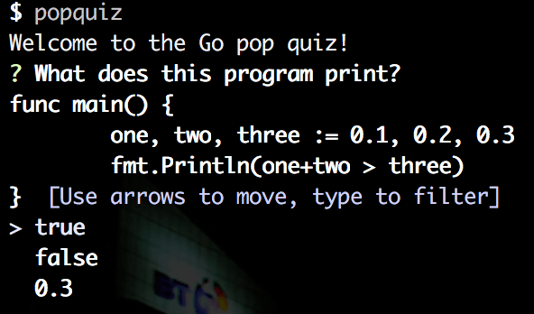
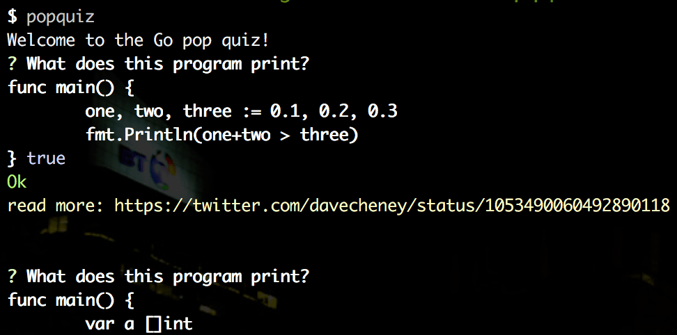

# Go Lang Pop Quiz

A collection of pop quizzes from around the internet for the Go programming language.

[https://golang.org/](https://golang.org/)


```
$ go get github.com/SchumacherFM/popquiz
$ go run main.go
```

or 

```
$ go install github.com/SchumacherFM/popquiz
$ popquiz
```






### Feel free to contribute and send me pull requests!

The MIT License (MIT)
